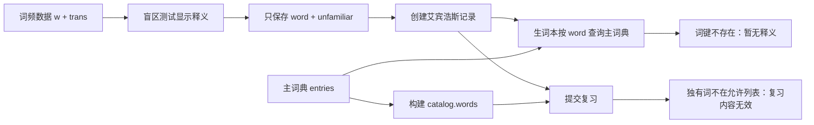
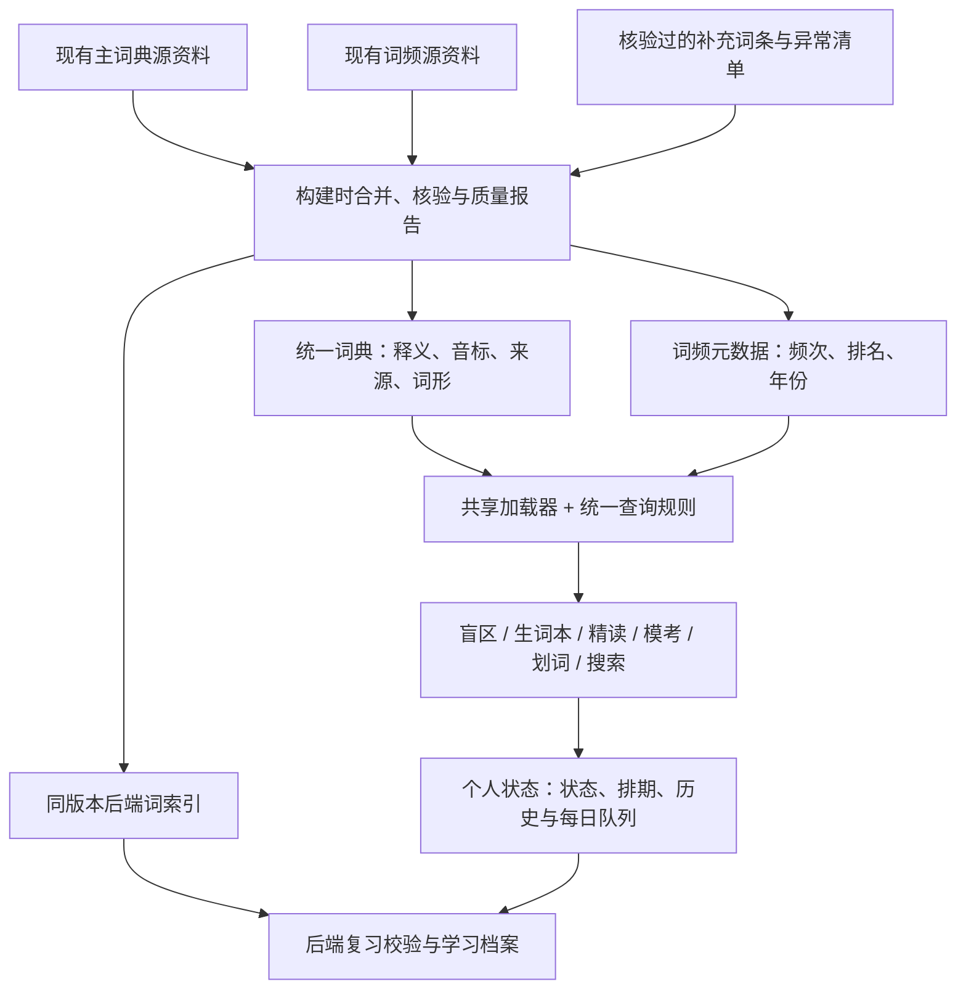

# 英语词典统一与释义完整性方案

日期：2026-10-07。代码基线：`eee27eb2b591baf314d0c6f39c343ffe56efcd5b`。

**状态：仅分析与方案，尚未实施。** 本轮只读取源码和公开 JSON，未修改词库、组件、接口、学习记录或构建脚本，未部署。项目全貌见 [整体架构](PROJECT-ARCHITECTURE.md)。

后续维护记录：以上状态描述方案编写时的分析轮次。2026-10-07 用户提供实现并要求审查、测试后推送，当前首阶段实施及验证状态见 [审查记录](LEXICON-REVIEW-2026-10-07.md)，原方案保留供对照。

## 1. 结论与建议

问题不是盲区测试完全没有释义，而是**盲区测试与生词本查的不是同一份词典**。盲区测试使用词频数据中的 `trans`，加入生词本时只保存单词和状态，生词本则只按原词查询主词典的 `definition_cn`。两份词表有 290 个未交集词，因此一部分词在测试中有中文、加入后却显示“暂无释义”。

后端也有同样的边界：英语复习的允许词列表仅由主词典生成。这些词即使加上前端备用释义，提交复习仍可能被后端拒绝。修复需要覆盖**词条数据、全部查询入口、后端 catalog，以及已有学习记录的兼容**。

推荐：构建时汇总现有资料，生成一套统一公共词典；词频、年份和出处作为关联元数据保留；前后端使用一致的查词和词身份规则。先保持现有单词键和排期结构兼容，解决查不到释义及无法提交复习，再按核验结果处理词形别名与历史迁移。

## 2. 两套数据的实际审计

统计依据为当前仓库源 JSON，按单词小写、去除首尾空白进行精确比对；未对用户私人数据取样。

| 项目 | 主词典 | 词频 / 盲区数据 |
| --- | --- | --- |
| 源文件 | `apps/english/public/data/kaoyan1_dict.json` | `apps/english/public/data/vocab_stats/vocab_stats_all.json` |
| 结构 | `entries[word]` 对象 | 词条数组，以 `w` 表示单词 |
| 词条数量 | 6,673 | 3,149，归一化后无重复词键 |
| 释义字段 | `definition_cn` | `trans` |
| 额外信息 | 音标、核心词标记、题目/句子关联 | 词频、排序、年份、考纲标记、音标、原词形等 |
| 空释义 | 6 | 0 |
| 文件体积（源文件字节） | 2,112,054 | 1,409,245 |

集合关系：

- 两者共有 2,859 个词键。
- 词频数据独有 290 个词键，这 290 个词全部有非空 `trans`。
- 主词典独有 3,814 个词键。
- 当前两表的精确词形并集是 **6,963 个词键**。它不是核验过的考纲词数，也不是词形合并后的词元数。
- 当前主词典按应用实际筛选条件得到 **762 个核心真题词**：有释义，且有核心标记、句子关联或题目关联。

盲区测试还会过滤基础词再分层抽样，因此 290 是两表断链词的总数，不代表每次测试有 290 个缺义词，也不代表这 290 个都一定被抽到。

以下词在词频数据有释义，但不在主词典：

| 单词 | 当前词频数据中的释义 | 主词典直接查询 |
| --- | --- | --- |
| `probable` | a. 很可能的，大概的；有希望的，可能的 | 不存在 |
| `deliberate` | a. 深思熟虑的，故意的；vt. 研讨，商讨 | 不存在 |
| `precise` | a. 精确的，准确的 | 不存在 |
| `used` | a. 用旧了的，旧的；习惯于……；过去惯/经常 | 不存在 |
| `provided` | conj. 倘若，只要，假如 | 不存在 |

共有的 2,859 词，其两来源的释义文本均存在字面差异。这不能解读为 2,859 条语义矛盾：词性缩写、标点、换行和义项范围都可造成差异。合并时要保留来源与补充义项，不能直接覆盖或只凭文字不同判断错误。

### 主词典的 6 条空记录

这 6 条记录只有 `type`，没有释义，词频数据也没有对应词，无法直接用现有 `trans` 补齐。

| 词键 | 仓库原文证据 | 建议处理 |
| --- | --- | --- |
| `auyeung` | 2020 原文出现 Bonnie Auyeung | 按上下文核验为人名，保留名称说明与出处 |
| `hietanen` | 2020 原文出现研究者 Jari Hietanen | 按人名处理，不虚构普通词义 |
| `mulcaire` | 2015 原文出现 Glenn Mulcaire | 按人名处理并保留原文关联 |
| `pavlopetri` | 2025 原文指一个遗址的现代名称 | 按地名/遗址名核验并说明 |
| `tokarczuk` | 2026 原文列出 Olga Tokarczuk 等作家 | 按人名处理并保留出处 |
| `selfievanity` | 2026 试卷及语法素材包含该连写形式 | 疑似连写/分词问题，核对原资料后决定词组或异常词形映射 |

原文扫描只是分类依据，没有完成全部外部释义或原卷核验。上述词先进入质量待审清单；发布时必须有已核验说明或明确异常标记，不能用无依据释义凑满数量。

## 3. 缺陷的数据流与源码证据



| 位置 | 当前行为 | 影响 |
| --- | --- | --- |
| `VocabBlindSpotModal.tsx` 的 `loadVocab`、`handleSaveAllUnknown` | 从词频文件读 `trans`，调用 `saveWordStatus(w.w, 'unfamiliar')` | 加入生词本没有传递释义来源，也未检查统一查词是否可解析 |
| `utils/readingStorage.ts` 的 `saveWordStatus` | 单词小写、trim 后保存状态 | 记录本身不含释义；公共词条查询正确时这种设计可以保留 |
| `App.tsx` 的 `handleToggleStatus` | 直接以传入 word 为键，并同步复习记录 | 与其他入口的归一化规则不完全一致 |
| `utils/ebbinghaus.ts` 的 `syncAllWordsToEbbinghaus` | 核心词及用户标记词进入排期；不要求主词典有词条 | 独有词能加入，但后续读义/复习不一定成功 |
| `EbbinghausNotebookModal.tsx` 的 `currentEntry`、全词表和搜索 | 使用 `dict.entries[word]` | 缺词显示暂无释义，中文搜索也找不到词频来源释义 |
| `WordLookupPopover.tsx` 的 `resolveLemma` | 只查主词典，自带一套后缀词形推断 | 划词与盲区测试的解析结果可能不同 |
| `IntensiveReadingView.tsx` | 单独加载两份资料，局部使用主词典或 `trans` 备用释义 | 只在精读局部正常，未成为全局能力 |
| `QuizMode.tsx`、`App.tsx` | 分别加载主词典 | 重复获取、解析和维护加载状态 |
| `utils/vocabLemmatizer.ts`、`wordRelations.ts` | 另有候选词形和关联词处理 | 同一词在各组件的匹配规则可能不同 |
| `scripts/prepare-english.cjs` | 只从主词典生成 `catalog.words` | 前端单独补义无法改变后端词允许列表 |
| `services/english.js` 的 `/api/english/review`、`/library` | 复习校验 `Object.hasOwn(c.words, word)`，档案也从 `c.words` 取义 | 独有词被拒绝，档案释义也存在缺口 |

此外，`App.tsx` 空闲加载词典时吞掉失败，词典尚未加载或加载失败也可能表现为无释义。应把“加载中”“资源失败”和“确实缺词”分开显示。

基础词集合、不规则词形表属于分类/解析辅助；有道音频和跳转属于外部工具。这些不等于另外两套完整本地释义词典。

## 4. 目标设计：公共词典统一，学习状态独立



### 4.1 数据组织

保留原始两份文件作为可追溯的构建输入，不再让新版组件各自挑选释义来源。建议新增词库编译步骤，输出：

| 拟议产物 | 内容与作用 |
| --- | --- |
| `lexicon.<内容摘要>.json` | 一套统一词条，供所有释义、音标、词形查询 |
| `vocab-frequency.<内容摘要>.json` | 频次、年份、排序、考纲标签及关联；不重复维护释义 |
| `lexicon-manifest.json` | 版本、摘要、路径、词条数、质量概况；保证客户端同时取得同版本资产 |
| 后端 `catalog` 的词索引 | 由同一次编译结果派生，供复习验证和档案展示；不是另一套人工词典 |
| 构建质量报告 | 新增词、空项、待审词、别名冲突、关联丢失与版本差异 |

第一版词条沿用 `DictEntry` 的 `definition_cn`、`phonetic`、`is_kaoyan_key`、`task_ids`、`sentence_ids`，降低组件和旧数据迁移风险；补充 `headword`、`sources`、`quality` 等信息。结构化义项可逐步增加，但原文释义必须保留，不能用脆弱的标点切分破坏多义内容。

个人学习记录继续存单词状态、排期、复习历史和个人备注，不为每个用户复制整套公共词典。历史备份中的自定义释义可作为带来源标记的个人备用内容，不能直接写入全站公共词条。

第一阶段仍以现有规范单词键定位记录；永久词条 ID 如需引入，必须另做版本化迁移，不能在释义修复时顺手批量改键。

### 4.2 合并规则与完整性范围

1. 精确规范词键匹配优先。规范化处理大小写、Unicode 和首尾标点；保留词内连字符、撇号及有效词组边界，避免现有“删掉所有非字母”的过度清洗。
2. 主词典有有效释义时保留为主显示；词频中不同的有效义项保留为补充来源，经过规则/人工核验再结构化去重。
3. 主词典缺词或释义为空时，用词频 `trans` 补充；保留原来源、音标和出处。290 个独有词可据现有资料修复查询断链。
4. 空释义且没有备用来源的 6 条，分别核验专名及异常词形。普通词要求有效释义；专名要求上下文说明；异常项要求明确映射或待审状态。
5. 无词频的主词典词保留，排名设为 `null`，不能用 0 冒充高频排序。`byYear` 的源值目前是 JSON 字符串，编译时解析和校验。
6. 保留主词典已有题目、句子关联；频次统计与引用数量不强行视为同一指标，不伪造出处或核心标签。
7. 公共资料有元数据不代表每条外部词典内容授权均已核验。现有资料可溯源保留，新增外部批量词源需同时确认来源和使用许可。

“完整”的验收范围先限定为：现有两套词表、现有 762 个核心词、支持的公共学习入口及旧记录解析。随后扫描公开课程/试卷中的实际词形，生成经分词后的未覆盖报告；人名、数字、OCR 错误、词组和罕见词不能混成一个普通词缺口指标。

对词库范围之外的旧导入词：保留学习记录并明确提示待补充，可展示备份已有释义或个人注记，不删除、不伪造译义。不能承诺覆盖所有英语词汇，或在没有核验时把 6,963 当成最终正确词数。

### 4.3 统一查询与词形解析

建议提供一个公共 `DictionaryService` 和可被构建/后端复用的纯查询契约：

```text
loadDictionary() → 共享 Promise 与 loading / ready / error 状态
lookup(rawWord) → 原词、规范词键、匹配类型、词条或明确缺失原因
getDefinition(wordKey) → 全部页面一致的主释义和补充义项
search(query) → 英文、中文、词形检索
getFrequency(wordKey) / getExamReferences(wordKey) → 可选的关联元数据
```

匹配顺序：精确词条 → 明确核验的词形别名 → 保守的屈折词形候选。歧义时保留候选，不将第一个词根当作确定答案。

`used` 和 `provided` 在现有词频数据中有独立形容词/连词义，不能只改成 `use`、`provide` 就算修复；`bore` 等多义词也不能仅凭不规则动词表覆盖原条目。同一原词的显示、标记和复习必须沿用一致结果。

不同组件不再自己实现后缀剥离、释义备用顺序和重复 fetch。`vocabLemmatizer` 可以保留词汇覆盖率计算，但词形解析交由共同规则；基础词分类只影响测试抽样，不决定能否查到释义。

### 4.4 加载、离线与效率

- 每个页面生命周期复用一次加载 Promise 和已解析索引，避免 React 组件各读整份 JSON。
- 入口继续按需加载；打开词汇功能时优先确保词典就绪，不以“暂无释义”代替加载状态。加载失败提供重试，失败 Promise 不永久堵死后续查询。
- 公共词库按内容摘要缓存；小型 manifest 重新验证，匹配版本的词典与频率索引作为完整组合启用。
- 如增加 IndexedDB 公共词库缓存，使用独立命名空间，不与账号队列、私人快照或个人导出混合。
- 使用已经验证过的本地词库副本支持离线查询；首次离线且没有缓存时明确提示，不能保证冷启动离线也有整套资料。
- 中文检索、词形索引与关联计算构建时预处理或按需复用；先测量词库体积、解析时间及搜索成本，再决定是否分片，不预先引入复杂远程查词依赖。

## 5. 各功能、后端与学习联动改造范围

| 范围 | 拟议修改 | 验收目的 |
| --- | --- | --- |
| `App.tsx`、`QuizMode.tsx`、`IntensiveReadingView.tsx` | 使用共享加载器；统一查询、状态键及词条引用 | 精读和模考不再各维护一套备用释义 |
| `VocabBlindSpotModal.tsx`、`VocabStatsView.tsx` | 抽样/排序仍用频率数据，释义通过统一服务 | 测试中所见释义与加入生词本后相同 |
| `EbbinghausNotebookModal.tsx`、`WordDetailModal.tsx` | 翻面、列表、中文搜索和关联词统一取义 | 独有词有释义，中文可搜索 |
| `WordLookupPopover.tsx`、`wordRelations.ts`、`vocabLemmatizer.ts` | 复用统一词形契约 | 划词、相关词和页面词义一致 |
| `prepare-english.cjs` 与新编译步骤 | 同版本生成公共词典、元数据及后端词索引 | 后端允许词和前端可查词一致 |
| `services/english.js` | 按统一规则验证复习词、显示档案词义，兼容旧合法词键 | 290 个断链词可正常复习及进入档案 |
| `english-schema.js`、同步、导出/恢复 | 保持旧字段合法；新增字段显式版本化 | 云端、本地、恢复及登录合并均保留词汇数据 |

继续区分“完整词典”与“学习子集”：核心侧栏仍按当前核心规则选取 762 词，盲区仍按词频分层抽样，生词本显示核心排期及用户主动加入的词。不得把 6,963 个公共词条自动注册成每天待背词。

共享成长账本的到期复习 +3 以服务器确认结果为准；修复释义、迁移词键、导入词库都不发积分。别名兼容必须进入奖励去重判定，否则同一天用两个词形提交可能重复领取。前端排期字段与 `english_state.cards` 的后端到期状态要分别保留并验证，不以更换词典为由重置学习阶段。

## 6. 旧记录、同步与迁移策略

### 第一阶段：优先无损修复

第一阶段不重命名现有 `kaoyan_word_statuses`、`kaoyan_ebbinghaus_records` 等键，不批量改动个人记录。统一词典覆盖旧词键；因此已经加入的 `probable` 等记录在换用统一查询后应直接恢复释义，不要求用户删除后重新添加。

状态对象仍为 `word → 状态枚举`。不要把释义对象直接塞进状态值，现有 `english-schema.js` 会拒绝此数据，也会破坏旧客户端。

### 第二阶段：仅对已核验词形做版本化归并

若后续确需把大小写、屈折词形或异常词形归并，先生成映射和迁移预览，并完成以下保护：

1. 导出可恢复备份，记录词库与迁移版本；保持旧客户端词键的兼容读取和提交。
2. 覆盖状态、艾宾浩斯记录、每日队列/已通过词、后端复习卡、个人备注和历史导入，而非只改一个 map。
3. 保留复习历史、次数、时间、难度与原词形。无法可靠合并时保留两条并报告；不能简单选最大阶段、覆盖一条或重置为未学。
4. 旧状态没有时间戳时不能假设遍历顺序代表新旧；冲突采用保守保留并明确呈现，不静默把生词升级成熟词。
5. 同一用户服务端迁移使用事务和持久版本标记，可重试且不重复发学习奖励；浏览器按当前身份完成本地迁移。
6. 兼容已有离线队列及 `_studyBase` 摘要。不能改写待重放请求正文却继续使用原操作编号；旧请求先通过兼容层解释，再安全迁移记录。
7. 保留历史学习事件去重关系，避免更换词键后重复 +3；账号切换、访客登录归并和旧英语备份恢复使用同样的映射规则。

第一阶段能解决当前释义断链，第二阶段不应成为第一阶段上线的强制前置。词形归并需要额外测试，不能与简单数据补齐一起做不透明迁移。

## 7. 分步实施与验收

| 步骤 | 交付 | 通过条件 |
| --- | --- | --- |
| 1. 固定数据基线 | 只读审计工具、来源摘要与差异报告 | 可重现 6,673 / 3,149 / 290；列出空项和关联差异 |
| 2. 编译统一词库 | 编译器、词条/频率产物、manifest、质量报告 | 3,149 个词频词全部有可展示有效释义；保留原核心关联；6 个空项有明确核验结果/异常状态 |
| 3. 统一前端查询 | 共享加载器、查词规则，迁移所有词汇组件 | 盲区、背词、划词、精读、模考与中文搜索对同词一致 |
| 4. 对齐后端 | catalog、复习校验与档案释义 | 290 个独有词不再因词表缺失被拒；非法词仍按规则拒绝 |
| 5. 验证已有记录 | 合成旧备份、离线队列、账号与恢复场景 | 无需重新添加即可读义；排期/次数/历史不丢；无重复奖励 |
| 6. 集成验收 | 本地完整构建、隔离 Worker 测试、浏览器录验 | 关键词全链路通过、版本缓存正确、加载失败可恢复 |
| 7. 发布 | 将来实施时的代码提交、Cloudflare 发布及公共资源核验 | 经上述验证后再发布；本轮不执行 |

### 必须覆盖的验证场景

- 数据检查：所有 3,149 个频率词可解析；290 个独有词逐项验证；主词典原有非空义项及题目/句子关联不丢；别名目标存在、无循环、歧义被报告。
- 实际问题复现：在可控测试样本中加入 `probable`、`deliberate`、`precise`，测试显示释义 → 标为不认识 → 加入生词本 → 翻面/搜索 → 刷新后仍存在。不要依赖随机抽样碰巧抽中。
- 后端链路：独有词提交合法复习成功；到期事件正常记 +3，同日重复、请求重放与别名提交不能重复奖励；未到期复习不额外奖励。
- 词形：`used`、`provided` 保留其独立义项，歧义词不会被错误词根覆盖；连字符、撇号、大小写及 Unicode 输入行为一致。
- 用户数据：旧生词状态、复习阶段/历史、每日目标和队列保持；旧英语备份、全站恢复、访客登录归并及双设备冲突不丢数据。
- 网络与缓存：词典尚未加载、加载失败、重试、已缓存离线与无缓存离线分别有正确状态；同一 manifest 不会混用新旧词库。
- 页面范围：762 核心词侧栏及 40 词分层测试的业务范围保持；合并词条不扩张每日复习队列。
- 效率：记录改造前后的数据传输量、重复请求数、解析耗时与搜索耗时；普通进入非词汇页面不强制解析整套词库。

以上是实施时应完成的验收，不是本轮已经通过的测试。

## 8. 建议采用的实施范围

首轮实施覆盖：**词库合并与质量报告、所有前端查词入口、同版本后端词索引、旧单词键兼容、关键数据与联动测试**。这能直接解决当前“测试有释义、生词本无释义”的问题，同时避免只修一处界面后在复习和档案里继续断链。

人名/地名说明与 `selfievanity` 原资料核验单独列质量清单；大规模词形归并、全部资料词形扩充及结构化义项精修作为后续步骤。当前没有进行这些修改，也没有触发 GitHub 上传或 Cloudflare 部署。
