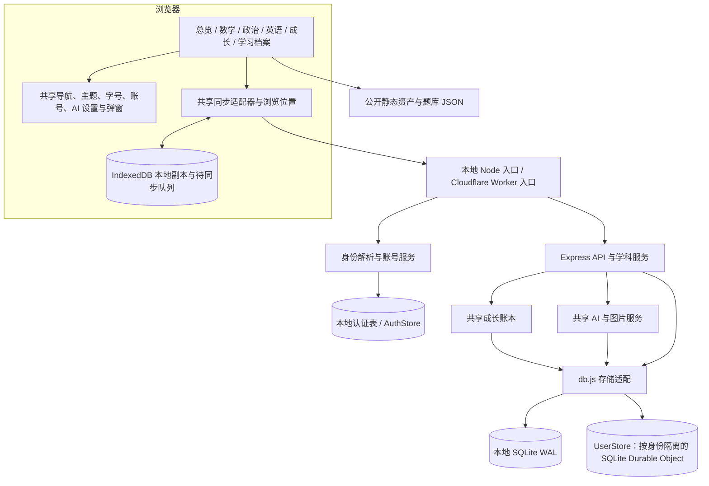

# 真题库项目整体架构

记录日期：2026-10-07。分析基线：`eee27eb2b591baf314d0c6f39c343ffe56efcd5b`。

本文依据该基线的仓库代码、构建配置和已有实施记录整理，主体描述**分析时的实现快照**。最初文档轮次只读取源码及公开资料、编写文档，没有修改业务代码、词库或用户记录，没有构建或部署。当时的拟议方案见 [词典统一与释义完整性方案](DICTIONARY-UNIFICATION-PLAN-2026-10-07.md)；后续实施见以下维护补记。

维护补记：本文主体是上述基线快照。后续词典首阶段实现增加 `scripts/compile-lexicon.cjs`、`apps/english/src/services/dictionaryService.ts` 和前后端共用的 `public/shared/lexicon.mjs`。运行时统一词条与词频以 manifest 和内容摘要关联，后端复习索引来自同一次编译；私人学习记录结构保持兼容。审查及限制见 [词典审查记录](LEXICON-REVIEW-2026-10-07.md)。

## 1. 总体结构

项目是同一仓库、同一站点域名下的多入口学习平台。数学、政治、英语、成长打卡和学习档案共用账号、同步、AI 配置、学习奖励与全站外观；各科仍保留自己的页面组织及学习数据结构。

前端不是一个覆盖所有模块的 React 应用：政治和英语是独立构建的 React 应用，数学主要由已有编译产物运行，总览、档案与成长页面使用 HTML/JavaScript。后端是共享 Express 业务服务，既能在本地 Node.js 运行，也能通过 Cloudflare 的 Node 兼容适配运行。当前没有独立部署的学科微服务。



图中的本地和 Cloudflare 是两种运行方式，不是同一次请求同时写入的两个服务器。网站的“双重保存”指浏览器本地副本与当前服务器的数据保存。

## 2. 页面入口与前端职责

| 页面入口 | 当前实现与主要位置 | 职责 |
| --- | --- | --- |
| `/` | `public/hub/index.html` | 三科学习总览、每日目标与成长汇总 |
| `/library` | `public/hub/library.html` | 汇总学科笔记、收藏、错题与复习入口 |
| `/math` 及数学子路由 | `public/index.html`、`public/assets/` | 数学真题、方法、练习、复习、分析及模考 |
| `/politics` 及子路由 | `apps/politics/src/` → `public/politics-app/` | 题册、章节练习、复习、错题、收藏、笔记与年份练习卷 |
| `/english` 及查询参数 | `apps/english/src/` → `public/english-app/` | 精读、全真模拟、词汇盲区、词频、背词、翻译、作文、语法等 |
| `/growth` | `public/growth/` | 每日打卡、积分、代币、任务、契约及虚拟奖励 |

政治使用 React Router 组织页面；英语主要由 `App.tsx` 的功能标签及 `tab`、`year`、`pass` 等 URL 参数组织页面。共享层保存上次浏览位置，显式题目链接优先于位置恢复。

### 共享前端层

| 文件 | 职责 |
| --- | --- |
| `public/shared/platform.js`、`platform.css` | 全站导航、主题、字号、个人入口、学习进度、位置与统一样式 |
| `public/shared/account.js` | 注册、登录、密码修改与恢复码交互 |
| `public/shared/sync.js` | 单一 `fetch` 同步适配、本地持久化、离线队列、重放、冲突与身份隔离 |
| `public/shared/operations.js` | 前后端共用的成长操作清单 |
| `public/shared/focus.js` | 自绘弹窗焦点、键盘循环与背景交互管理 |
| `public/shared/images.js` | AI 图片附件交互 |
| `public/shared/math-review.mjs` | 数学复习接入共享学习联动 |
| `public/assets/ai-settings.js` | 全站模型设置面板 |

全局设置、账号、进度等弹窗使用统一定位与背景样式。英语笔记和 AI 助手属于覆盖式阅读面板，背景保持清晰，便于对照原文。各科仍有自己的组件和薄请求封装，因此共享外观不等于所有实现已经归并。

## 3. 后端分层与请求路径

### 入口及服务

| 层 | 主要文件 | 职责 |
| --- | --- | --- |
| 本地入口 | `server.js` | Express 中间件、路由及静态页面；默认监听回环地址 |
| 云端入口 | `worker.mjs`、`wrangler.jsonc` | 静态资源改写、跨站校验、账号识别、Durable Object 分发及响应缓存边界 |
| 认证 | `services/auth-core.js`、`auth-local.js` | 用户名、密码、恢复码、会话及限流；云端使用 `AuthStore` |
| 数学业务 | `server.js`、`datasets.js`、`solutionEngine.js`、`examService.js` | 题库索引、作答、解析、笔记、复习、试卷和结果 |
| 学科整合 | `services/integration.js` | 挂载政治、英语、导出、成长操作，并汇总 `/api/study/overview` |
| 政治 / 英语 | `services/politics.js`、`english.js`、`english-schema.js` | 学科判分、状态、笔记、复习、资料目录与英语字段验证 |
| 成长 | `services/growth.js` | 目标、积分、学习事件去重、任务与虚拟账本 |
| AI | `aiService.js`、`services/assistant.js`、`ai-client.js`、`ai-routes.js`、`outbound.js` | 学科答疑、追问、批阅、成长复盘及供应商调用 |
| 图片 | `services/images.js` | 图片验证、归属、配额及模型附件读取 |
| 同步 / 恢复 | `services/study-sync.js`、`study-export.js`、`study-restore.js` | 修订、幂等、冲突、快照、备份预览及合并/替换 |
| 存储与公共内容 | `db.js`、`services/content.js`、`public-api.js` | 个人文档持久化、公共 JSON 读取缓存与公开题库接口 |
| 迁移 / 运行约束 | `account-migration.js`、`private-migration.js`、`storage-budget.js`、`body-limit.js`、`telemetry.js` | 访客归并、私有附件迁移、限长、配额及脱敏日志 |

`server.js` 先挂载可公开读取的题库接口，再处理身份、JSON 请求限长、认证、同步写入中间件和具体业务。公开内容不进入个人学习快照；私人接口按身份读取数据。

云端请求路径：

1. 页面及资产请求由 Worker 改写到 `ASSETS`。例如 `/english` 指向 `/english-app/index.html`。
2. 公共题库 API 可直接返回缓存响应；私人 API 先解析访客 Cookie 或账号会话。
3. `AuthStore` 使用 `accounts-v1` 对象保存账号注册表，解析登录令牌；账号数据与访客数据使用不同 `UserStore`。
4. Worker 覆写内部身份头，将请求发到对应 `UserStore`，通过 `handleAsNodeRequest` 调用同一 Express 服务。
5. `db.runWithStorage(...)` 将该请求的 SQL 存储、身份及公共资产绑定到异步上下文，避免不同用户共用个人状态。
6. 私人响应标记 `private, no-store`；公开资源使用自己的缓存策略。

当前 Cloudflare 配置使用 `ASSETS`、`USER_STORE`、`AUTH_STORE`；没有配置 D1、R2 或 KV。

## 4. 公共资料、个人数据与持久化

### 公共资料的构建来源

| 模块 | 源资料与处理 | 发布位置 |
| --- | --- | --- |
| 数学 | `public/api/`、`public/data/`，由 `datasets.js` 建立内存索引 | 原公开 JSON 与数学前端资产 |
| 政治 | `apps/politics/src/data/banks/` → `scripts/prepare-politics.cjs`；生成稳定 `pol:` 题号并校验题型、答案格式 | `public/politics-data/` |
| 英语 | `apps/english/public/data/`、`images/`、`thumbs/` → `scripts/prepare-english.cjs` | `public/english-data/`、`english-images/`、`english-thumbs/` |

英语构建生成 `catalog.json`：包括试卷、题目、精读句子、旧题号映射、单词和练习索引。常规题号使用 `年份:题号`，精读旧编号映射到相应真题编号。缺失的原卷题目不凭空补造；精读已有同题参考答案可以复用试卷资料。

政治资料带有整理/导入来源标记，部分内容含生成题目；年份标签不构成独立核验的官方真题认证。当前数学标准答案也并非全部完整。内容可信度与程序是否正常运行是两项独立事项。

### 个人数据位置

| 层 | 存储形式 | 保存内容 |
| --- | --- | --- |
| 浏览器偏好 | `localStorage` | 主题、字号等偏好及部分兼容信息 |
| 浏览器学习副本 | IndexedDB `question-bank-study` | 按身份分区的快照、本地记录、待提交操作、位置及英语草稿 |
| 本地服务器 | `data/study.sqlite`，WAL | `documents(scope,name,value)` 与 `auth_registry(key,value)` |
| Cloudflare 个人存储 | 每个身份的 SQLite `UserStore` | `documents(name,value)`；对象本身隔离用户 |
| Cloudflare 账号注册表 | SQLite `AuthStore` | 账号、密码摘要、恢复码摘要、会话及访问预算 |

业务仍大量使用“JSON 文档”模型，而非全部拆成逐题关系表。主要文档包括数学的 `user_progress`、`user_notes`、`user_review`、试卷及草稿，政治的 `politics_state`，英语的 `english_state` 和 `english_storage`，成长的 `growth_state`，以及共享 `study_positions`。

英语有两种互补的状态：

- `english_storage`：保留前端兼容键，如 `kaoyan_word_statuses`、`kaoyan_ebbinghaus_records`、每日队列、模考草稿和精读进度。API 接受 JSON 字符串补丁，物理存储已按英语键拆分，避免每次重写整份文档。
- `english_state`：后端的作答、复习卡、题目/句子笔记和整卷记录。后端依此核发奖励、汇总学习档案。

前端艾宾浩斯排期与后端奖励复习卡不是同一个字段。调整词身份或复习逻辑时，必须同时考虑两边及备份契约，不能只修改界面卡片。

`db.js` 使用 `AsyncLocalStorage` 选择当前身份和存储适配。普通写入先暂存变化，再通过本地 SQLite 事务或云端 `transactionSync` 提交；云端较大文档会分块。完整学习文档依然存在解析及序列化成本。

## 5. 同步、账号与学习联动

### 保存流程

1. 用户修改学习记录，操作先持久化到当前身份的浏览器队列。
2. 同步层带稳定操作编号、正文摘要及基础修订信息向服务器提交。
3. 服务器验证身份、字段、基础版本和幂等记录；同一编号不同正文返回冲突。
4. 业务数据、奖励、修订和重放结果在同一用户存储事务中提交，再更新本地确认状态。
5. 网络失败保留本地操作，恢复网络后重放；永久错误隔离，同一记录维持顺序，独立记录可继续。

“已保存在本地”不等于“云端已确认”。账号切换不能重放另一身份的队列；同一笔记或英语草稿的跨设备冲突需要保留并处理。公共词典加载不应与私人学习状态同步混在一起。

### 账号及恢复

用户名会规范化，密码使用带随机盐的 scrypt，恢复码与会话令牌保存摘要。Cookie 为 HttpOnly、SameSite=Lax，HTTPS 下启用 Secure 和 `__Host-` 前缀。会话有有效期，改密/恢复会撤销旧会话并更新恢复码。

访客登录后迁入账号：冻结来源、记录导入进度、合并学习数据、迁移 AI 配置和图片，支持失败后重试。这是跨 Durable Object 的可恢复多步骤迁移，不是跨对象全局事务。

全站备份覆盖学习文档和位置，并兼容旧英语备份；恢复先预览，再合并或替换。密码、会话、恢复码、AI 密钥和图片文件不在学习导出中。图片和 AI 配置由独立私有迁移处理。

### 成长联动

| 有效事件 | 默认奖励 | 判定边界 |
| --- | --- | --- |
| 完成不同题目 | +2 | 服务端有效作答；同日同学科同题去重 |
| 完成到期复习 | +3 | 后端判定已到期，避免重复领取 |
| 保存有效笔记 | +2 | 去除空白后至少 10 字，并按学习事件去重 |
| 完成整卷模考 | +20 | 校验整卷提交；同一次整卷不再叠加逐题奖励 |

按北京时间统计每天的数学、政治、英语、复习和笔记目标，目标可调整。奖励影响成长账本、里程碑及相关行动契约。草稿、备份导入、纯查词和模型生成文本不代表学习完成。

## 6. AI 与图片系统

各科通过共享服务器配置调用模型，前端不需要保存密钥。统一服务处理模型供应商、文字/图片消息、超时、取消和响应限长；出站仅允许当前预设中的官方 HTTPS 主机，并拒绝重定向。

图片先经服务端验证和身份归属检查，保存在对应用户的私有文档中；调用模型时组装 Base64 附件，不依赖公开 R2 图片桶。单张上限 5 MB、每次最多 3 张，并有用户总量配额。文本模型和图片模型可以分别配置。

模型的答疑、批阅和复盘结果不能绕过作答校验或直接给成长账本记账。AI 网络等待已移出用户长写锁，最终持久化使用短事务。具体格式与供应商契约仍由 AI 适配层承担。

## 7. 构建、验证与发布

主要技术：Node.js ≥22.13、Express、React 18、TypeScript、Vite、英语 Tailwind CSS 4、Cloudflare Wrangler。依赖范围见 `package.json`，实际安装版本由 `package-lock.json` 固定。

```text
npm run prepare:data
  ├─ 政治 JSON 目录生成与校验
  ├─ 英语资料、图片、缩略图与后端 catalog 生成
  └─ 数学 Markdown 安全补丁产物生成
        ↓
npm run build:ui
  └─ 上述准备 + 政治/英语 TypeScript 检查和 Vite 构建
        ↓
npm run build
  └─ build:ui + Wrangler dry-run
        ↓
npm run verify
  └─ build + Node 测试
        ↓
npm run deploy
  └─ Wrangler 发布 Worker 与 public 资产
```

政治/英语的前端及公开数据发布目录、`dist/`、运行数据库与 `.wrangler/` 被 Git 忽略；源码和源资料受版本管理。数学现有编译资产受版本管理。

数学目前只恢复了 Markdown token 还原函数、基线产物和可复现补丁脚本（`apps/math/src/restoreTokens.cjs`、`apps/math/vendor/Md-baseline.js`、`scripts/prepare-math.cjs`），**没有恢复完整数学前端源码和完整构建链**。

已有实施记录描述 GitHub `main` → Cloudflare Builds 的发布流程。仓库中的 `.github/workflows/` 当前被忽略，不能据此认为 GitHub Actions 已启用。云端发布配置属于外部状态，本轮没有重新检查或触发发布。

`test/` 覆盖账号、API、学习联动、恢复、复习及同步客户端。历史实施记录为本地 87 项中 85 通过、2 项 Worker 专用跳过，隔离 Worker 契约 45 项通过；这是此前结果，不是本文编写时的新一轮测试。详见 [审查改进实施记录](PROJECT-REVIEW-FIXES-2026-10-05.md)。

## 8. 当前边界与后续维护重点

| 当前边界 | 对维护的影响 |
| --- | --- |
| 数学完整前端源码缺失 | 不能把已有补丁构建视为完整重建；大规模改造需先恢复源码 |
| 多入口前端及各科薄封装仍并存 | 共用能力应继续集中到共享层，避免各科自行复制账号、设置或同步逻辑 |
| 英语释义来自两套数据，词形解析也分散 | 盲区测试、生词本、划词、中文搜索及后端复习出现不一致；见专项方案 |
| 公共内容并非全部独立核验 | 数据完整度、出处和程序行为需分别验收 |
| 大量个人状态仍是 JSON 文档 | 长历史下的解析、序列化和主线程 SQLite 成本仍需测量；没有完整 p95 基线 |
| 公共缓存与私人快照边界明确 | 新词库可按版本缓存，不能混入个人同步或用户数据导出 |
| 跨发布旧前端 chunk 留存策略尚未完整建立 | 全新云端构建后的旧标签页兼容仍需专项处理 |
| 跨对象迁移与部分复习字段合并仍有语义限制 | 后续词身份迁移不能假设通用 JSON 合并能正确合并排期与历史 |

相关文档：[账号、保存与位置](ACCOUNTS-SYNC.md)、[学习联动](INTEGRATION.md)、[AI 图片与英语整合](AI-IMAGES-ENGLISH.md)、[历史项目审查](PROJECT-REVIEW-2026-10-05.md)。历史文档有各自日期，当前行为应以本次代码基线和实施记录为准。
